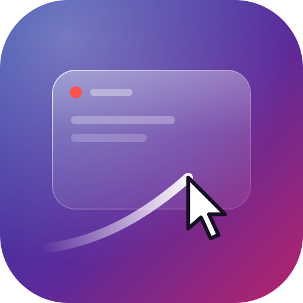

<p align="center">
  
</p>

# glide

Polished screen recordings and screenshots for Linux. Record a window and glide
turns it into a 4K video with the window centered on your wallpaper, rounded
corners, a smooth redrawn cursor, and an optional camera that zooms in and
follows your cursor. Screenshots get the same treatment as a 4K PNG.

It is inspired by macOS tools like Screen Studio and works on Linux desktops,
on both Wayland (KDE Plasma, GNOME, COSMIC, Hyprland, Sway and other wlroots
compositors) and X11.

## Features

- **Window or screen recording** through the desktop's ScreenCast portal, so
  you pick what to share in the system dialog.
- **Centered on your wallpaper.** The finished video places the window in the
  middle of your current desktop wallpaper (or a gradient, or any image) with
  rounded corners. The wallpaper is detected on KDE Plasma, GNOME, Ubuntu,
  Budgie, Cinnamon, MATE, Xfce and COSMIC, and from hyprpaper, swww and swaybg.
- **Cursor-following zoom (opt-in).** With `--zoom`, the camera looks ahead
  and zooms into where you are working, then eases back out when the cursor
  roams or rests.
- **Polished screenshots.** Capture a window or the whole screen as a 4K
  PNG, framed the same way as the videos.
- **Click effects (opt-in).** A soft ripple marks every click and touchpad
  tap.
- **Smooth cursor.** The real cursor is hidden while recording and redrawn
  afterwards as a crisp, smoothed arrow at any zoom level.
- **4K output, rendered on the GPU.** Compositing runs in a wgpu compute
  shader and encoding uses VAAPI hardware H.264, falling back to x264 when
  VAAPI is unavailable.
- **Liquid Glass toolbar.** `glide ui` shows a draggable floating toolbar
  with a liquid selection highlight, glossy buttons and real background blur
  where the compositor supports it.

## Requirements

- Linux with a Wayland or X11 session. On X11, a compositing window manager
  is needed for the glass toolbar.
- On Wayland, PipeWire and `xdg-desktop-portal` with the backend for your
  desktop:

  | Desktop | Portal backend |
  | --- | --- |
  | KDE Plasma | `xdg-desktop-portal-kde` |
  | GNOME, Ubuntu, Budgie | `xdg-desktop-portal-gnome` |
  | COSMIC | `xdg-desktop-portal-cosmic` |
  | Hyprland | `xdg-desktop-portal-hyprland` |
  | Sway, river, labwc and other wlroots | `xdg-desktop-portal-wlr` |

- `ffmpeg` and `ffprobe` on `PATH`. VAAPI support is used when available.
- A GPU with Vulkan (or OpenGL ES) drivers.
- Rust 1.95 or newer, plus the PipeWire development headers and `clang` to
  build the PipeWire bindings.

On Arch Linux (swap the portal backend for your desktop):

```sh
sudo pacman -S --needed rustup clang pipewire ffmpeg vulkan-icd-loader xdg-desktop-portal-kde
```

On Debian or Ubuntu:

```sh
sudo apt install clang libpipewire-0.3-dev ffmpeg libvulkan1 xdg-desktop-portal-gnome
```

Install Rust itself with [rustup](https://rustup.rs).

## Install

```sh
curl -fsSL https://raw.githubusercontent.com/zNi0q/glide/master/install.sh | sh
```

This downloads the latest release for your machine, checks its checksum,
installs `glide` to `~/.local/bin`, and adds glide to your application menu.

To install by hand instead, download the archive for your machine
(`x86_64-linux` or `aarch64-linux`) from the
[latest release](https://github.com/zNi0q/glide/releases/latest), then:

```sh
sha256sum -c glide-*-linux.tar.gz.sha256
tar -xzf glide-*-linux.tar.gz
install -Dm755 glide-*-linux/glide ~/.local/bin/glide
```

The binary needs glibc 2.39 or newer (Ubuntu 24.04, Debian 13, Fedora 40, Arch
and newer), plus PipeWire, libxkbcommon, `ffmpeg` and your desktop's portal
backend at runtime. These are already installed on most Wayland desktops. On
older distributions, build from source instead.

## Updating

When a new version is released, the toolbar shows **glide x.y.z is
available** above it. Press **Update**, then **Restart**. From a terminal:

```sh
glide update
```

It shows the new version, asks before installing, verifies the download, and
replaces the installed binary.

## Build from source

```sh
cargo build --release
```

The binary is `target/release/glide`.

## Usage

### Toolbar

```sh
glide ui
```

A glass toolbar appears near the bottom of the screen. Drag it anywhere.

On KDE Plasma, COSMIC, Hyprland, Sway and other compositors with layer-shell,
the toolbar floats above all windows. GNOME has no layer-shell, so there the
toolbar opens as a small borderless window that you drag like any window.

1. Choose **Window** or **Screen**, then **Effects** (cursor zoom and click
   ripples) and a **Background**.
2. Press **Record** and pick what to record: in the system dialog on Wayland,
   or by clicking the window on X11 (Esc cancels).
3. Press **■** in the recording pill to stop.
4. glide renders the video and shows **Open** and **Show in folder**.

While recording the whole screen, the pill is invisible so it never appears
in your video. Move the pointer to where it was (bottom center by default)
and it fades in. glide cuts the video just before the pill appeared.

Press **Screenshot** instead of Record to capture a single polished image.

Press **Esc** or **✕** to close the toolbar.

Videos are saved to `~/Videos/glide/` and screenshots to `~/Pictures/glide/`
(your XDG directories). Raw recordings are kept in `~/.cache/glide/` so they can
be rendered again.

#### Keyboard shortcut

Bind a shortcut to the full path of `glide ui`, for example **Super+Shift+R**:

- **KDE Plasma:** System Settings → Keyboard → Shortcuts → Add New → Command
  or Script.
- **GNOME:** Settings → Keyboard → View and Customize Shortcuts → Custom
  Shortcuts.
- **COSMIC:** Settings → Keyboard → Keyboard Shortcuts → Custom Shortcuts.
- **Hyprland:** `bind = SUPER SHIFT, R, exec, glide ui` in `hyprland.conf`.
- **Sway:** `bindsym $mod+Shift+r exec glide ui` in your Sway config.

### Command line

Record a window into a directory. Press **Ctrl+C** to stop:

```sh
glide record myvideo
```

Render it:

```sh
glide render myvideo -o myvideo.mp4
glide render myvideo -o myvideo.mp4 --zoom
glide render myvideo -o myvideo.mp4 --zoom 2.5
glide render myvideo -o myvideo.mp4 --background ~/Pictures/backdrop.jpg
```

| Option | Meaning |
| --- | --- |
| `-o, --output <file>` | Output video (default `glide.mp4`). |
| `--zoom [factor]` | Follow the cursor with zoom, up to `factor` (1 to 4, default 1.8). Without it the video is not zoomed. |
| `--background <image>` | Use an image behind the window instead of your desktop wallpaper. |
| `--clicks` | Draw a ripple wherever you clicked. |

### Click effects

glide records every click while recording, and draws ripples when the click
effect is turned on. On X11 this works out of the box. On Wayland, apps are not
allowed to see clicks in other windows, so glide reads the mouse device
directly. That needs your user in the `input` group, once:

```sh
sudo usermod -aG input $USER
```

Then log out and back in. Note that members of `input` can also read keyboard
input; glide only opens mouse and touchpad devices.

Take a screenshot of a window, or of the whole screen with `--screen`:

```sh
glide screenshot -o shot.png
glide screenshot -o shot.png --screen
glide screenshot -o shot.png --background ~/Pictures/backdrop.jpg
```

## How it works

```
record:  portal ─► PipeWire frames ─► lossless screen.mkv
                   cursor metadata ─► cursor.txt (one position per frame)

render:  ffmpeg decode ─► GPU compute shader ─► NV12 ─► VAAPI H.264 ─► mp4
                          (wallpaper, rounded window, camera, cursor)

screenshot: portal ─► one PipeWire frame ─► GPU compute shader ─► RGBA ─► png

X11:     Composite window pixmap / root window ─► same files and pipeline
```

- `src/record.rs` talks to the ScreenCast portal and PipeWire. The cursor is
  requested as metadata, so frames are recorded without it and its position
  is logged separately.
- `src/x11.rs` captures on X11 through the Composite extension and reads
  clicks with XInput2. `src/clicks.rs` reads clicks from mouse and touchpad
  devices on Wayland.
- `src/camera.rs` plans the camera offline with look-ahead and smooths every
  move with critically damped springs.
- `src/composite.wgsl` and `src/gpu.rs` composite each frame on the GPU and
  write NV12 directly for the hardware encoder, or full RGBA for screenshots.
- `src/render.rs` pipelines decoding, compositing and encoding on separate
  threads.
- `src/ui/` is the toolbar, drawn with egui and wgpu: a full-screen
  click-through layer-shell surface, a borderless window where layer-shell is
  missing, or a shaped override-redirect window on X11. Blur comes from the
  standard `ext-background-effect` protocol or KDE's blur protocols, whichever
  the desktop offers.

## Limitations

- Developed and tested on KDE Plasma 6 (Wayland). X11 support is tested under
  XWayland; other desktops use the same standard portals and protocols but
  have not been tested by the author yet.
- On Wayland, click effects need the `input` group (see Click effects).
- Without background blur support (for example on GNOME), the toolbar glass
  is tinted but not blurred.
- If a desktop's portal cannot report the cursor separately, the cursor is
  recorded into the video instead, and zoom cannot follow it.
- Some portals can only share whole screens, not single windows.
- Videos are always 3840×2160 at 60 fps. A 1080p window is upscaled, so the
  window's own text gains no extra detail.
- Resizing a window while recording crops it to its starting size.
- When recording the whole screen, the toolbar's stop pill is visible in the
  recording.

## Development

```sh
cargo fmt
cargo clippy --all-targets -- -D warnings
cargo test
cargo test --release -- --include-ignored
```

The last command also runs the tests that need a GPU and ffmpeg.

### Releasing

Every push to `master` is built and tested on GitHub Actions. To publish a
release, raise `version` in `Cargo.toml`, run `cargo build` so `Cargo.lock`
follows, then commit and push. When the workflow sees a version without a
release, it tags it, builds x86_64 and aarch64 archives, and publishes them.
Installed copies of glide then offer the update.

`design/toolbar-preview.html` is an interactive mockup of the toolbar styles.
Open it in a browser, optionally with `?wallpaper=file:///path/to/image.jpg`.

## License

glide is free for non-commercial use under the
[PolyForm Noncommercial License 1.0.0](LICENSE).

You may use, study, modify and share it for personal projects, hobbies,
research, education, and charitable or public organizations. Any commercial
use, including selling glide or building it into a paid product or service,
is not permitted without written permission from the author.
